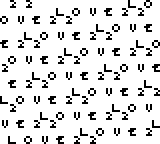

COMPO & PLATFORMS
=================
This is for the 64 Byte Oldschool Intro compo of LoveByte22.
Target platforms is the Game Boy Color (CGB) and for v1.0.1 also Game Boy Advance (AGB).

WHAT RUNS WHERE
===============
`tinymirrorboy.384b.cgb` should work with all emulators and cartridges, where this doesn’t work `tinymirrorboy.16k.cgb` or `tinymirrorboy.32k.cgb` should run.
It was tested on [SameBoy][] (v0.14.3; CGB modus), [Emulicious][] (only with original CGB bootrom; CGB modus), [BGB][] (v1.5.9; CGB modus) and on CGB (CGB-D) with [EVERDRIVE GB X3][edgbx3].
I know no target where the actual 64B ROM `tinymirrorboy.64b.cgb` runs.

v1.0.1
------
Tested on [SameBoy][] (v0.14.3; AGB modus) and [Emulicious][] (only with original AGB bootrom; CGB modus), but not on real hardware

TRICKS USED
===========
* Only half logo (24B;CGB doesn’t check more)
* Abuse logo to load custom 4x4 as upscaled 8x8 tiles into VRAM
* Use ROM mirroring to fill rest of header with data from logo
* DMG compatibility mode (has standard colors configurable via 1B and palette shifting is cheaper)

TRICKS NOT USED
===============
* Running through the logo (only the second half has illegal instructions; instead I sacrificed 2B for a relative jump and cleaner/reliable register values)

CONCEPT
=======
The Game Boy header is consider being 80B (`$100`-`$14F` as defined by [gbdev pandocs][doc]) long. I already knew that the CGB bootrom only needs half the logo and the header checksum. I wanted to explore wether necessary ROM size can be further reduced by wrapping the ROM around, which would be done by ignoring the upper 13 bits of the address. I wanted to see if the logo sets the header to some values that makes the bootrom refuse to start it and if it’s feasable to hack the header checksum like I hacked the title checksum in my last intro.

MOTIVATION
==========
This self built Game Boy 96B cartridge by insideGadgets: https://www.youtube.com/watch?v=Ss0evFqgB6M
Their approach gives them only 16B that can be used for code. With my apporach there would be 71 (or 69 if you don’t count the mandatory `jr`) Bytes free.

PITFALLS
========
The header checksum can’t be directly set and must be fixed with bytes `$134`-`13F` or `$100`-`$10C`.

Title bytes `$100` and `$101` are surely lost for title checksum hacking.

`$103` needs values <`$80`, this allows only following opcodes:
* `nop`
* `stop`
* `jr`
* `ld` (without `ldh`, `ldhl`, `ld` with `(c)`, `ld` with 16b address, `ld sp, hl`)
* `inc`
* `dec`
* `halt`
* `rlca`
* `rla`
* `daa`
* `scf`
* `add` (only with 16b registers as second operand)
* `rrca`
* `rra`
* `cpl`
* `ccf`

PERSPECTIVE 
===========
What is considered the header could be from `$100`-`$11B` (28B): 2B `jr` + 1B header checksum + `$00` (CGB Byte) + 24B logo.
It gets trickier if you also want to hack the title checksum, then it would be 2B `jr` + title checksum + header checksum or 1B `rst` + title checksum + header checksum + `$00`, but this is unstable when you have to put checksum in the CGB Byte, for half the values it won’t boot in DMG compatibility mode. Having the header checksum in the title, makes it harder to hack the checksums.

Somebody could try to build this type `$66` (a value from the logo) cartridge that ignores the upper 13 bits of the address.

[SameBoy]: https://sameboy.github.io/
[Emulicious]: https://emulicious.net/
[BGB]: https://bgb.bircd.org/
[edgbx3]: https://everdrive.me/cartridges/edgbx3.html
[doc]: https://gbdev.io/pandocs/#the-cartridge-header